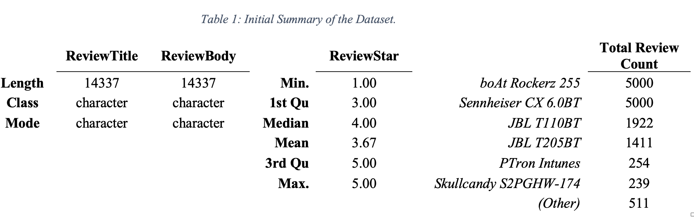
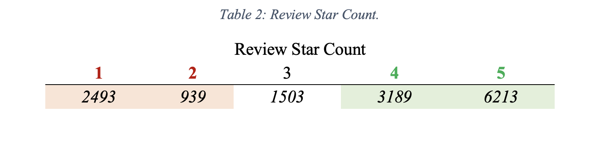
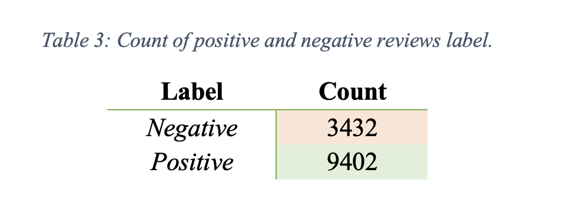

# Text Analysis Project on: 

***

## Introduction

Maintaining a competitive edge in the earphone market requires effective customer relations management, and customer feedback is crucial for business development and success.

The aim of this project is to exhibit my text mining skills on _Amazon Earphone Customer Reviews_ dataset on **Rstudio**. 

## Data Source 
I have used the data available at Kaggle website (_[Amazon Earphones Reviews, 2019](https://www.kaggle.com/datasets/shitalkat/amazonearphonesreviews)_). The dataset fulfils the requirements for the project and is in the CSV format.

## Problem Statement
**PTron Intunes** wants to investigate the major factors influencing customers' delight and disappointment with their product (_earphones_) to stay competitive. 

The project issues are divided into 2 stages. 

**#1.** Measuring the consumer sentiment accurately by **sentiment analysis**.

**#2:** Figuring out the major factors for consumer sentiements by using topic modelling (**LSA**).

## Data Analysis Concepts/Skills Demonstrated 

1.  Descriptive Analysis
2.  Labelling the data
3.  Sentiment Analysis
    - Valance Shifter
    - Confusion Matix (accuracy measurement)
    - Identifying the outliers
4.  Data Trasnformation for Topic modelling
5.  Topic modelling 
    - Term document matrix
    - N-grams
    - Weighted document-term matrix
    - Applied Latent Semantic Analysis (LSA)
***

## 1. Descriptive Analysis
There are **14337** reviews in the dataset. _Table 1_ shows that the mean of ReviewStar is near to
**4(3.67)**, which indicates that most customers are content with the product.

It appears that there are more positive reviews than negative ones, however the dataset does not follow the normal data trend. 
In support of our hypothesis based on Table 1, Table 2 shows the supporting data.

## 2. Labelling the data
-   The 3-stars observations are removed from the dataset
-   Marked the 4 and 5-stars observation as _positive_ and 1 and 2-stars observations as _negative_.

## 3. Sentiment Analysis
Sentiment analysis is run on the raw dataset to figure out the best lexicon to measure sentiment accuracy for the dataset so that we can convert the data from unlabelled to labelled one. For the sentiment analysis __3 different package__ (_sentimentr, meanr, syuzhet_) and __7 lexicons__ (_hu_liu, sentiword, jockers, bing, afinn, nrc and syuzhet_) were used. Individual consumer review is counted as an individual document for the sentiment analysis.  

## 4. Data Transformation for Topic modelling

## Modeling 

## Data Analysis &

## Findings & Recommendations 
