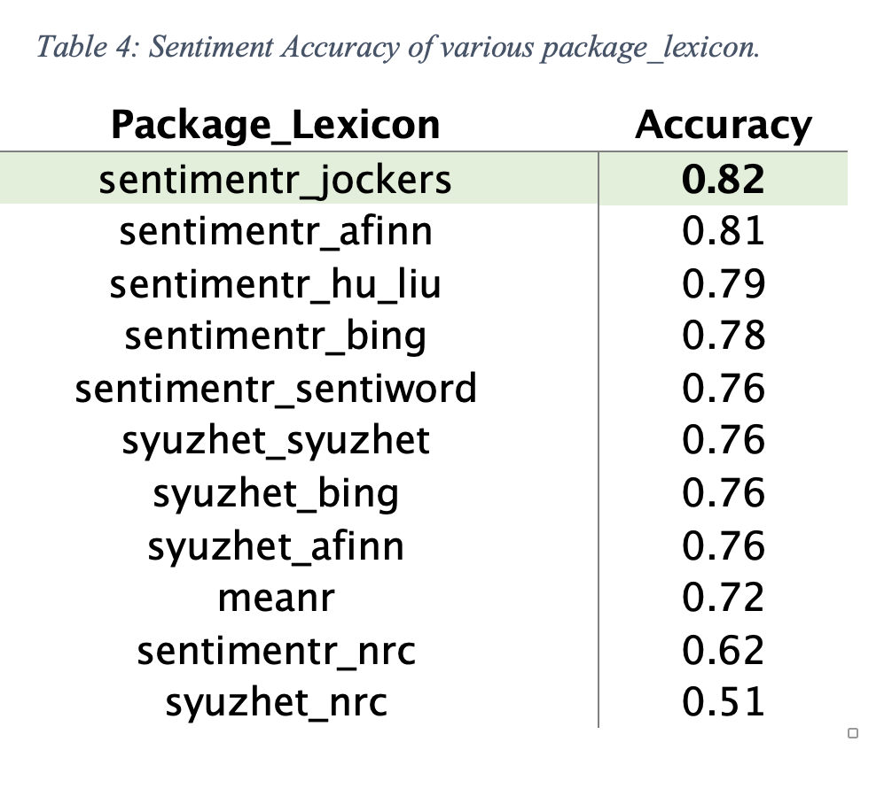
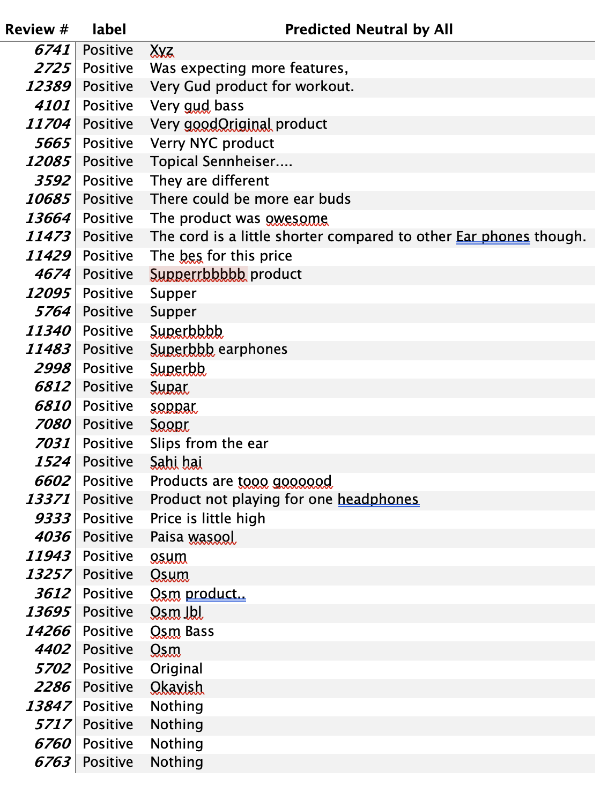
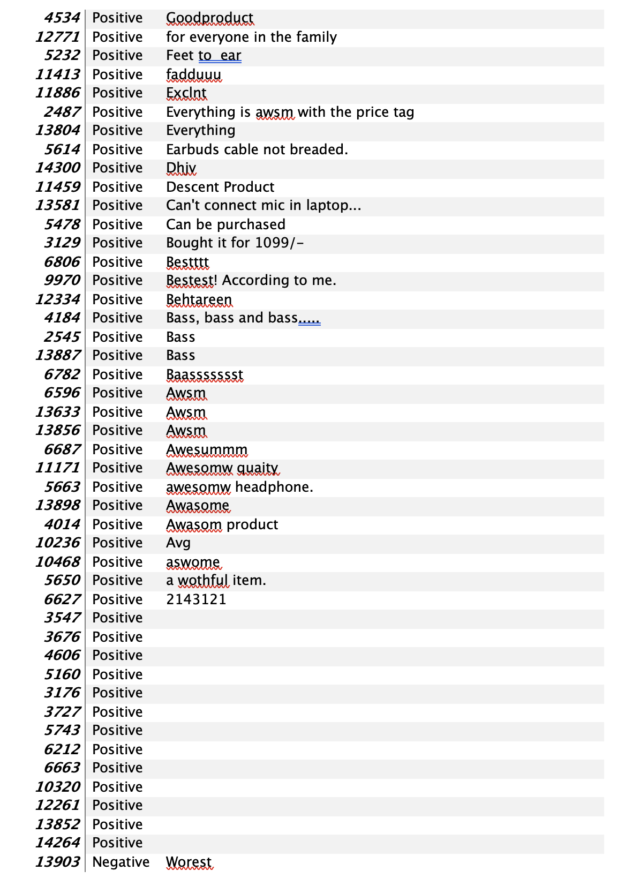
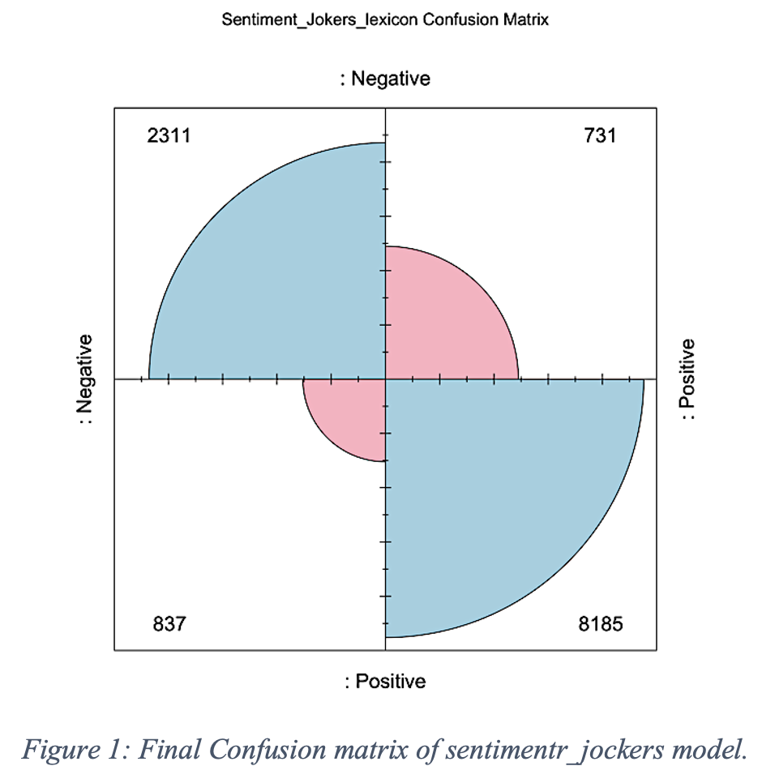

# Text Analysis Project on: 

***

## Introduction

Maintaining a competitive edge in the earphone market requires effective customer relations management, and customer feedback is crucial for business development and success.

The aim of this project is to exhibit my text mining skills on _Amazon Earphone Customer Reviews_ dataset on **Rstudio**. 

## Data Source 
I have used the data available at Kaggle website (_[Amazon Earphones Reviews, 2019](https://www.kaggle.com/datasets/shitalkat/amazonearphonesreviews)_). The dataset fulfils the requirements for the project and is in the CSV format.

## Problem Statement
**PTron Intunes** wants to investigate the major factors influencing customers' delight and disappointment with their product (_earphones_) to stay competitive. 

The project issues are divided into 2 stages. 

**#1.** Measuring the consumer sentiment accurately by **sentiment analysis**.

**#2:** Figuring out the major factors for consumer sentiements by using topic modelling (**LSA**).

## Data Analysis Concepts/Skills Demonstrated 

1.  Descriptive Analysis
2.  Labelling the data
3.  Sentiment Analysis
    - Valance Shifter
    - Identifying the outliers
    - Confusion Matix (accuracy measurement)
4.  Data Trasnformation for Topic modelling
5.  Topic modelling 
    - Term document matrix
    - N-grams
    - Weighted document-term matrix
    - Applied Latent Semantic Analysis (LSA)
***

## 1. Descriptive Analysis
There are **14337** reviews in the dataset. _Table 1_ shows that the mean of ReviewStar is near to
**4(3.67)**, which indicates that most customers are content with the product.

It appears that there are more positive reviews than negative ones, however the dataset does not follow the normal data trend. 
In support of our hypothesis based on Table 1, Table 2 shows the supporting data.

## 2. Labelling the data
-   The 3-stars observations are removed from the dataset
-   Marked the 4 and 5-stars observation as _positive_ and 1 and 2-stars observations as _negative_.

## 3. Sentiment Analysis
Sentiment analysis is run on the raw dataset to figure out the best lexicon to measure sentiment accuracy for the dataset so that we can convert the data from unlabelled to labelled one. For the sentiment analysis __3 different package__ (_sentimentr, meanr, syuzhet_) and __7 lexicons__ (_hu_liu, sentiword, jockers, bing, afinn, nrc and syuzhet_) were used. Individual consumer review is counted as an individual document for the sentiment analysis. 

Table 4 displays the results of the sentiment analysis. Sentimentr jockers (82%) had the highest accuracy of all the packages and lexicons, according to the results. Even though all the packages utilize the identical lexicons, the sentimentr package's results are much superior to those of the other packages. Valance shifter consideration is the cause of this. It tries to determine the word's context in the sentence. 

### 3.1 Valance Shifters
The polarized words are impacted by valence shifters. The entire emotion of the phrase may be overturned or overruled in the case of negators and adversative conjunctions. Therefore, a simple dictionary lookup might not accurately depict the sentiment if valence shifters happen frequently. The frequency with which valence shifters and polarized words occur together in sentences across the dataset is shown in the Table 5 below.

Around 31% of the time in this context, negators appear in sentences that contain polarized terms. However, only 17% of the time do adversarial conjunctions go together with polarized terms. If the valence shifters are ignored, the modelling of the document sentiments will suffer significantly which is reflected on Table 4.

### 3.1 Identifying the Outliers

Despite having an accuracy rating of up to 82%, sentimentr jockers made neutral predictions 770 times when it was unable to make a positive or negative prediction. These represent sentimentr jockers model outliers. Then, the outliers that are common to all the packages and lexicons are discovered and provided in Appendix A. 162 observations fit the neutral prediction. A few intriguing conclusions can be gained by analyzing each of these documents separately. They are: 
1.	Spelling mistake (goog, gud) 
2.	Different language (Sahi hai, Ekdum bakwaas)
3.	Empty response,
4.	Random responses (xyz, nil, JBL, Hi)
5.	Misleading responses. 

In order to recalibrate the sentimentr jockers model's accuracy, which is 87%, the outliers (neutral replies) are deleted. The model accurately recognized 8185 out of the 8916 (91.8%) positive reviews and 2311 out of the 3148 (73.4%) negative reviews. In total, 10496 out of the 12,064 (87%) were correctly labelled (Figure 1).

## 4. Data Transformation for Topic modelling
Instead of choosing all observations, the PTron Intunes product is chosen for further analysis. The LSA model only uses 208 of the 12,064 tagged documents as input. Before using LSA, some pre-processing is done after choosing the specific portion of the dataset.Pre-processing steps are: 
1.	Transforming everything to lower-case letter,
2.	Removing white spaces,
3.	Removing Punctuations,
4.	Removing Numbers,
5.	Removing Stopwords,
6.	Performing Stemming

## Modeling 

## Data Analysis &

## Findings & Recommendations 
